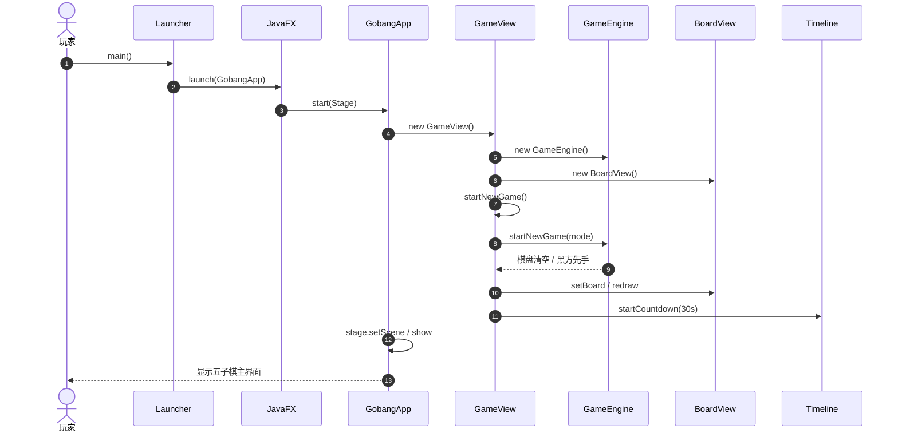
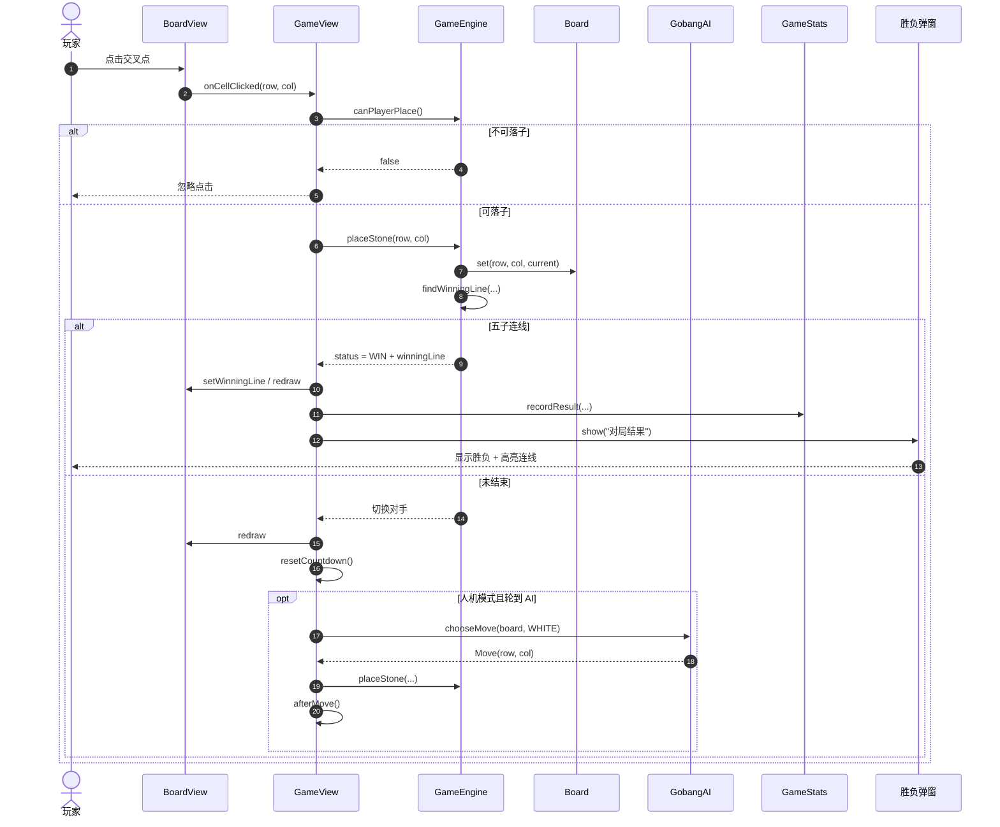
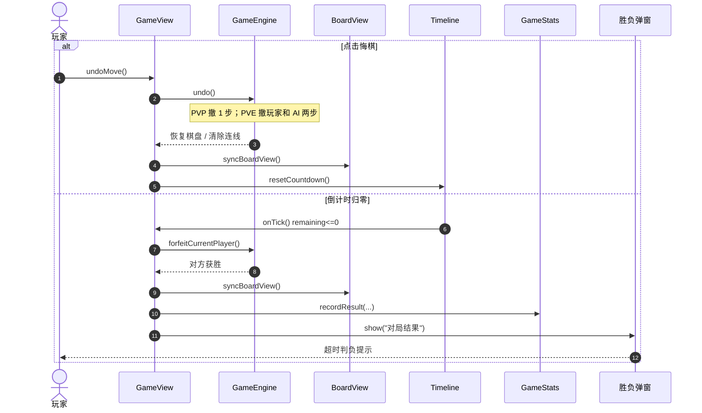
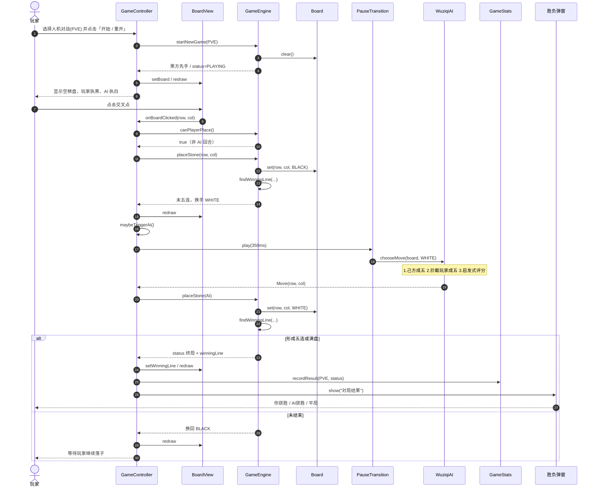

# 时序图

核心对象关系（wuziqi）：`Launcher → WuziqiApp → GameController`，对局逻辑在 `GameEngine`，界面在 `BoardView`，人机在 `WuziqiAI`，统计由 `GameStats` 持久化。

**下载 PNG：**

- [时序图-启动流程.png](images/时序图-启动流程.png)
- [时序图-落子与胜负判定.png](images/时序图-落子与胜负判定.png)
- [时序图-悔棋与超时判负.png](images/时序图-悔棋与超时判负.png)
- [时序图-人机对战.png](images/时序图-人机对战.png)
- 打包：`dist/时序图下载.zip`、`dist/wuziqi.zip`（人机对战时序图）

---

## 1. 启动流程

---

## 2. 落子与胜负判定（双人 / 人机）

---

## 3. 悔棋 / 超时判负

---

## 4. 人机对战（wuziqi：玩家执黑，AI 执白）

对应 `org.example.wuziqi`：`GameController` 选择 `GameMode.PVE` 后开局，玩家落子经 `canPlayerPlace` / `placeStone`，再由 `PauseTransition(350ms)` 触发 `WuziqiAI.chooseMove`。

