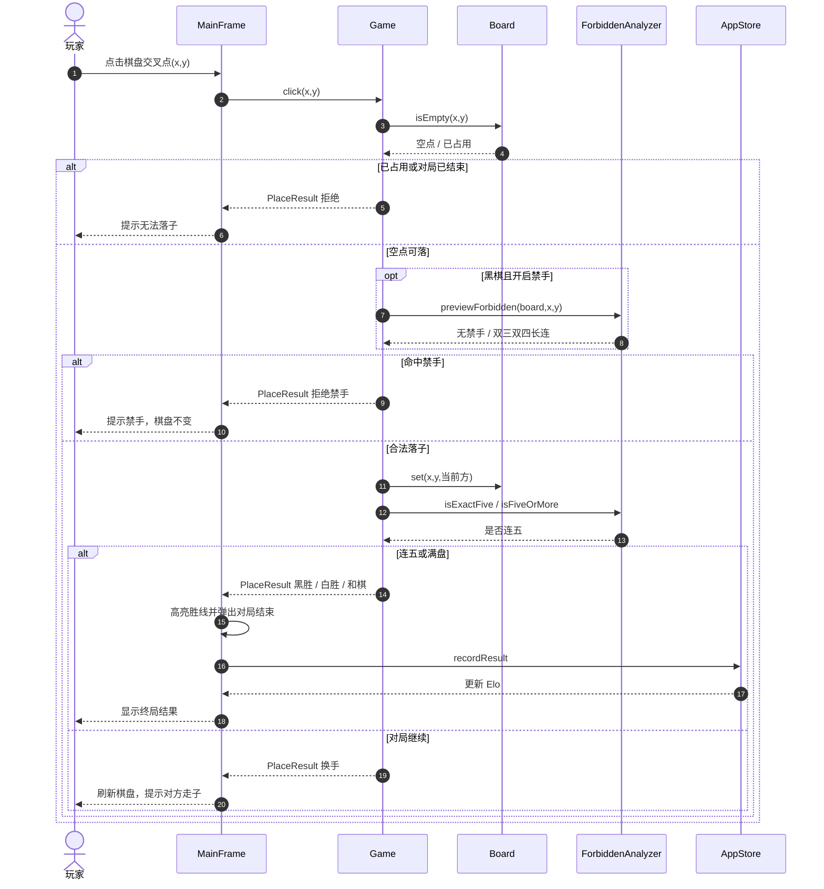
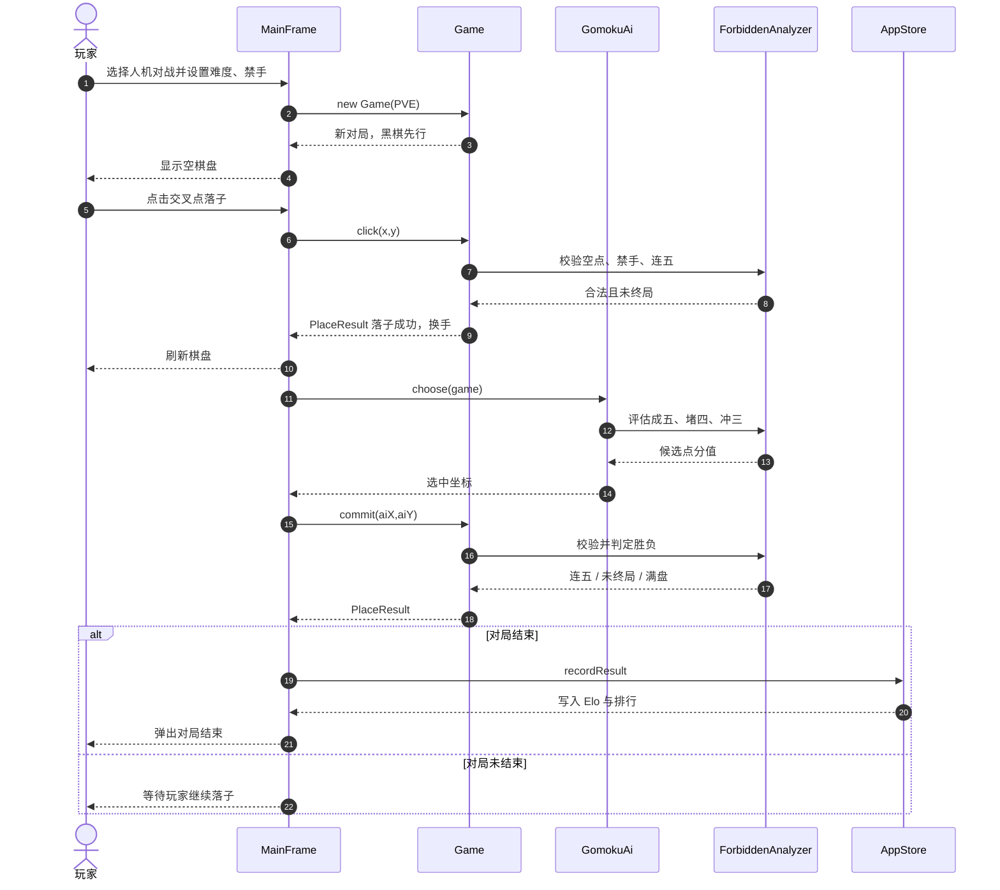

# 时序图

对象按当前实现：玩家操作进入 `MainFrame`，棋规在 `Game` / `ForbiddenAnalyzer`，人机回合由 `GomokuAi.choose` 选点后再 `commit`，终局写入 `AppStore`。

**下载 PNG：**

- [时序图1-对局落子.png](images/时序图1-对局落子.png)
- [时序图2-人机对战.png](images/时序图2-人机对战.png)
- 打包：`dist/时序图下载.zip`

---

## 时序图一：对局落子与胜负判定

玩家点击交叉点后，界面把坐标交给 `Game.click`。系统先查空点，黑棋再查禁手，合法则落子并判定连五或满盘。

---

## 时序图二：人机对战

玩家开局并落下一手后，界面调用 AI 选点，再由系统替 AI `commit`。若本轮终局则写 Elo 并弹窗，否则继续等玩家。

