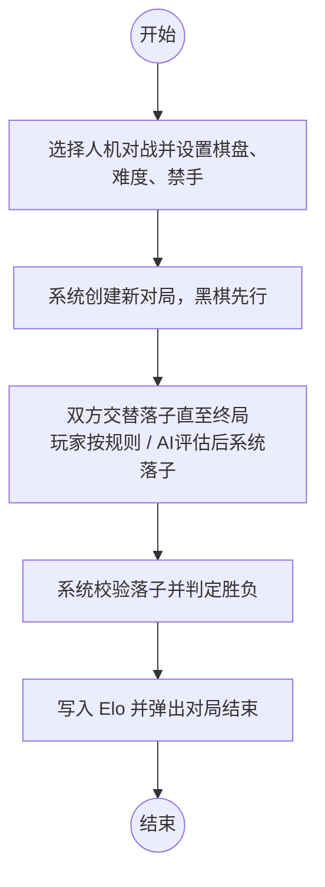
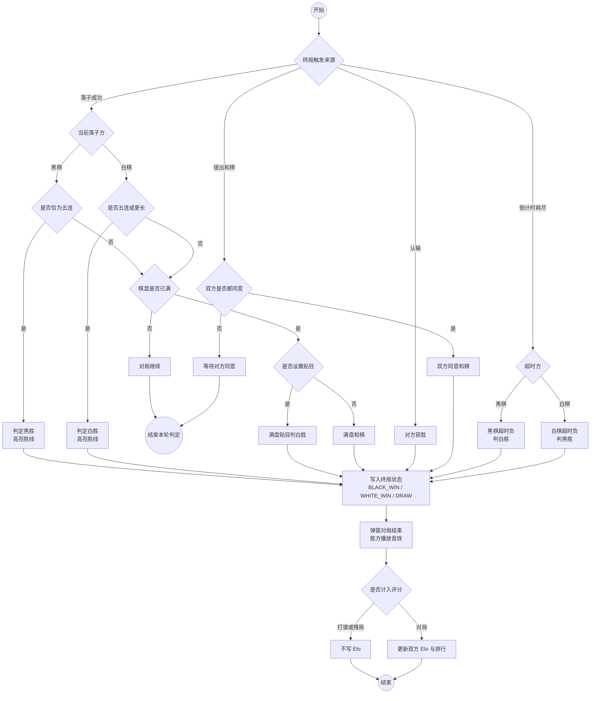

# 核心业务流活动图

对应需求分析中的两条主路径，均按当前实现整理：`Game.click` / `Game.commit` 负责落子与棋规，`MainFrame.maybeAi` 负责人机回合。

**下载 PNG：**

- [业务流1-对局落子与胜负判定.png](images/业务流1-对局落子与胜负判定.png)
- [业务流2-人机对战.png](images/业务流2-人机对战.png)
- [业务流3-胜负判决.png](images/业务流3-胜负判决.png)
- 打包：`dist/活动图下载.zip`

---

## 业务流一：对局落子与胜负判定

玩家在交叉点落子后，系统依次做空点校验、可选的落子确认、黑棋禁手、连五/满盘判定，再换手或终局。

```mermaid
flowchart TD
    start1((开始)) --> click[玩家点击棋盘交叉点]
    click --> over{对局是否已结束?}
    over -->|是| tipOver[提示：对局已结束]
    tipOver --> end1((结束))
    over -->|否| empty{该交叉点是否为空?}
    empty -->|否| tipOcc[提示：该点已有棋子]
    tipOcc --> click
    empty -->|是| confirm{是否开启落子确认?}
    confirm -->|是| same{是否再次点击同一点<br/>或按下确认?}
    same -->|否| pending[进入待确认状态<br/>WAIT CONFIRM]
    pending --> click
    same -->|是| forbidChk
    confirm -->|否| forbidChk{是否黑棋且开启禁手?}
    forbidChk -->|是| forbid{是否双三 / 双四 / 长连?}
    forbid -->|是| tipF[拒绝落子并提示禁手]
    tipF --> click
    forbid -->|否| place
    forbidChk -->|否| place[在交叉点落下当前方棋子]
    place --> five{是否连成五子?}
    five -->|是| win[判定当前方获胜<br/>高亮胜线并弹窗]
    win --> end1
    five -->|否| full{棋盘是否已满?}
    full -->|是| komi{是否设置贴目?}
    komi -->|是| whiteWin[判白胜]
    komi -->|否| draw[判和棋]
    whiteWin --> end1
    draw --> end1
    full -->|否| turn[换手：对方走子]
    turn --> click
```

**说明（与实现一致）**

- 黑棋开启连珠禁手时，双三、双四、长连不能落；白棋长连可胜，黑棋须恰为五连。
- 落子确认开启时，第一次点击只标记待确认点，再次点击同一点或菜单「确认落子」才真正 `commit`。
- 终局后写入本地 Elo，并弹出「对局结束」。

---

## 业务流二：人机对战（单业务流）

只保留「完成一局人机对战」这一条业务：直线从开局到结束，不再分玩家/AI 支路，也不再循环换手或询问再开。



**说明（与实现一致）**

- 这一条业务就是打完一局人机：设置、开局、对弈、判胜负、记分。
- 对弈细节（禁手、确认、换手）在业务流一中展开；终局细则在业务流三中展开。

---

## 业务流三：游戏胜负判决

落子、认输、和棋、超时四条入口汇入同一套终局规则。黑棋须恰为五连才胜，白棋五连及以上可胜；满盘时有贴目判白胜，否则和棋。



**说明（与实现一致）**

- 连五：`ForbiddenAnalyzer.isExactFive`（黑）与 `isFiveOrMore`（白），见 `Game.commit`。
- 认输：`Game.resign`，对方直接获胜。
- 和棋：双方都调用 `offerDraw` 后判 `DRAW`。
- 超时：`Game.tickSecond` 将当前方秒数减到 0 则判负。
- 打谱、残局不写入 Elo，普通对局与人机写入排行。

